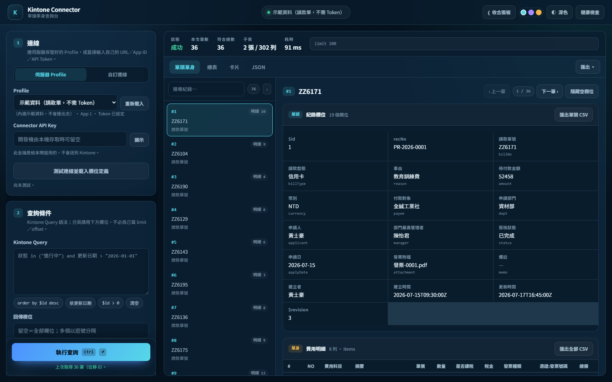
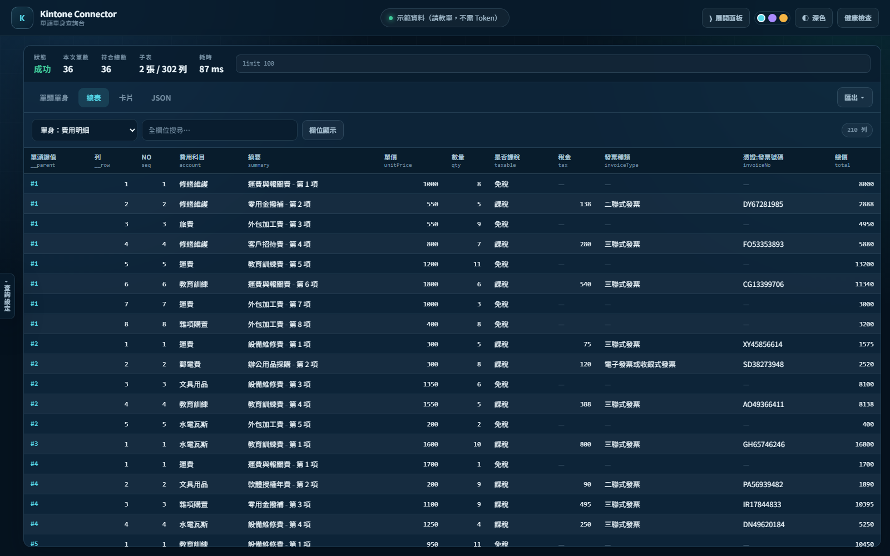
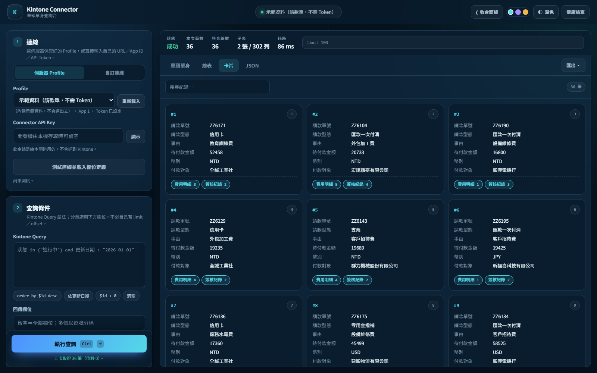

# Kintone Connector · 單頭單身查詢台

[](https://github.com/longwinerp/kintone-connector-demo/actions/workflows/build.yml)


一個 ASP.NET Core 的 Kintone 查詢閘道，把 Kintone 的 REST 回應整理成 **單頭（紀錄）／單身（子表格）**
兩層結構，並附一個可直接操作的網頁查詢台。

> A small ASP.NET Core gateway for Kintone that reshapes REST responses into a
> header/detail (master–detail) structure, with a zero-build web console for querying,
> browsing and exporting. Ships with built-in demo data — no Kintone account required.

**這個 Repo 內建示範資料，clone 下來直接跑就能看到完整畫面，不需要任何 Kintone 帳號或 API Token。**

---

## 畫面

> 📸 截圖待補。把圖片放進 [`docs/screenshots/`](docs/screenshots/)（檔名見該資料夾說明），
> 再把下方註解拿掉就會顯示。

<!-- 截圖放好後，刪掉這兩行註解標記即可顯示：
| 單頭單身：左邊紀錄清單，右邊單頭欄位 ＋ 各張子表格明細 |
| :---: |
|  |

| 總表（單頭＋單身合併） | 卡片檢視 |
| :---: | :---: |
|  |  |

| 連線設定（可存多組） | 深色主題 |
| :---: | :---: |
|  |  |
-->

## 為什麼需要它

Kintone 的 `records.json` 回傳的是巢狀結構，每個欄位都是 `{ "type": ..., "value": ... }`，
子表格（SUBTABLE）又再包一層。要接進 ERP、報表或 Excel 之前，通常得自己寫一堆攤平的程式碼。

這個專案把那段工作做完並固定下來：

- 一般欄位 → **單頭**，一筆紀錄一列
- `SUBTABLE` → **單身**，每張子表格一組資料，每列都帶著父紀錄的鍵值
- 使用者／組織欄位自動取 `name`、附件取檔名、複選欄位串接成字串

## 特色

| | |
| --- | --- |
| **兩種連線方式** | 伺服器保管的 Profile，或呼叫端自己輸入 URL／App ID／API Token |
| **多組連線管理** | 網頁上可存多組具名連線，一鍵切換、一鍵測試 |
| **四種檢視** | 單頭單身、總表（含單頭＋單身合併）、卡片、原始 JSON |
| **匯出** | 各層 CSV（含 BOM，Excel 直接開）與 JSON |
| **安全預設** | 強制 HTTPS、網域白名單防 SSRF、閘道金鑰、Token 不落地不入 log |
| **零前端建置** | 原生 ES Modules，沒有 npm、沒有打包，改完重新整理就生效 |
| **深淺主題** | 三組強調色、可收合面板，設定記在瀏覽器 |

## 快速開始

需要 [.NET SDK 10](https://dotnet.microsoft.com/download)。

```bash
git clone https://github.com/longwinerp/kintone-connector-demo.git
cd kintone-connector-demo
dotnet run --project KintoneConnector.Web/KintoneConnector.Web.csproj
```

開啟 <https://localhost:7298>，第一次進站會自動用示範資料查一次，
畫面上就會看到 36 筆請款單、兩張子表格（費用明細、簽核紀錄）。

示範資料的行為：

- 走的是**真正的程式流程**（查詢字串合併 → 取資料 → 單頭單身轉換），只是資料來源換成內建假資料
- 支援 `limit`、`offset`、`order by ... desc` 與欄位篩選
- 不支援 where 條件（示範模式會忽略）
- 資料以固定亂數種子產生，每次啟動內容都一樣

## 連自己的 Kintone

**方法一：網頁上直接填**（不用改設定檔）

切到「自訂連線」→ 填入網址、App ID、API Token → 「測試連線並載入欄位定義」→「執行查詢」。
填好可以按「＋ 存成一組」存進連線清單，之後一鍵切換。

**方法二：伺服器 Profile**（Token 不進瀏覽器）

參考 [`appsettings.Example.json`](KintoneConnector.Web/appsettings.Example.json) 加一組 profile，
Token 用 User Secrets 或環境變數提供：

```bash
dotnet user-secrets set "Kintone:Profiles:MyApp:ApiToken" "<你的 API Token>" --project KintoneConnector.Web
dotnet user-secrets set "Security:GatewayApiKey" "<自行產生的閘道金鑰>" --project KintoneConnector.Web
```

正式環境用環境變數：

```text
Kintone__Profiles__MyApp__ApiToken
Security__GatewayApiKey
```

## 畫面操作

1. **步驟 1 連線**：選 Profile 或填自訂連線 →「測試連線並載入欄位定義」
2. **步驟 2 查詢條件**：Kintone Query、欄位挑選器、單次筆數／位移
3. **執行查詢**：左欄底部固定的按鈕，或 `Ctrl + Enter`

結果區四個頁籤：

- **單頭單身** — 左邊紀錄清單，右邊上半單頭欄位、下半各張子表格明細
- **總表** — 可切換「單頭」／「單身」／「單頭＋單身（合併）」，支援排序、搜尋、欄位顯示切換
- **卡片** — 概覽，點卡片跳回單頭單身
- **JSON** — Kintone 原始 JSON 或整理後結構

快捷鍵：`Ctrl + Enter` 執行查詢、`Ctrl + B` 收合／展開左側面板。

## API

除了 `/health` 之外都要帶 `X-Connector-Api-Key`（Development 且從 localhost 存取時，
金鑰未設定則放行）。

| 端點 | 說明 |
| --- | --- |
| `GET /health` | 健康檢查 |
| `GET /api/profiles` | Profile 清單、是否開放自訂連線、網域白名單 |
| `GET\|POST /api/kintone/query` | 直接回傳 Kintone 原始 JSON |
| `POST /api/kintone/records` | 回傳整理成單頭單身的結果 |
| `POST /api/kintone/fields` | 回傳 App 欄位定義 |

```http
POST /api/kintone/records
Content-Type: application/json
X-Connector-Api-Key: <閘道金鑰>

{
  "profile": "Demo",
  "query": "order by $id desc",
  "fields": [],
  "limit": 100,
  "offset": 0,
  "totalCount": true,
  "withLabels": true,
  "includeRaw": false
}
```

要用自訂連線，把 `profile` 換成 `connection`：

```json
{
  "connection": {
    "baseUrl": "https://example.cybozu.com",
    "apiPath": "/k/v1/records.json",
    "appId": 100,
    "apiToken": "<API Token>"
  },
  "limit": 100
}
```

`limit` / `offset` 會覆寫 Query 結尾既有的分頁子句（Kintone 上限：limit 500、offset 10000）。
走 GET 時，`baseUrl`、`appId` 可放查詢字串，但 **API Token 只能放 `X-Kintone-Api-Token` 標頭**。

### 回應結構

```json
{
  "ok": true,
  "statusCode": 200,
  "elapsedMs": 118,
  "connection": { "label": "…", "appId": 1, "source": "demo" },
  "query": { "effective": "order by $id desc limit 3", "limit": 3, "offset": 0 },
  "totalCount": "36",
  "recordCount": 3,
  "keyField": "$id",
  "header": {
    "columns": [ { "code": "amount", "label": "待付款金額", "type": "NUMBER" } ],
    "rows": [
      {
        "key": "36",
        "index": 0,
        "values": { "amount": "9685", "payee": "昕福喜科技有限公司" },
        "detailCounts": { "items": 9, "approvals": 3 }
      }
    ],
    "rowCount": 3
  },
  "details": [
    {
      "code": "items",
      "label": "費用明細",
      "columns": [ { "code": "unitPrice", "label": "單價", "type": "NUMBER" } ],
      "rows": [ { "parentKey": "36", "rowId": "1720", "index": 0, "values": { "unitPrice": "2496" } } ],
      "rowCount": 17
    }
  ]
}
```

轉換規則：

- 單頭鍵值取 `$id`，沒有時取 `RECORD_NUMBER`，再沒有就用序號
- 使用者／組織／群組欄位取 `name`，附件取檔名，複選欄位以「、」串接，空字串一律轉 `null`
- 欄位順序：識別欄位在最前，建立者／更新時間／狀態等系統欄位在最後
- Kintone 回非 200 時，原樣帶回它的錯誤碼與訊息

## 安全性

自訂連線代表呼叫端可以指定連線目標，所以預設就上了鎖：

- 只允許 HTTPS，且網址不得帶帳密、查詢字串
- 網域結尾白名單（預設只有 cybozu／kintone 系列），可設 `"*"` 解除，僅建議封閉內網使用
- API 路徑只接受 `/k/v1/records.json` 或 `/k/guest/{空間編號}/v1/records.json`
- API Token 不寫入 log，也不允許放在網址列
- 網頁端的 Token 預設只留在 sessionStorage，使用者明確勾選才會存進 localStorage

要完全關閉自訂連線：`Kintone:AdHoc:Enabled = false`。

## 專案結構

```text
KintoneConnector.sln
global.json                          SDK 版本
KintoneConnector.Web/
  Program.cs                         設定 → 服務 → 管線 → 端點
  Endpoints/KintoneEndpoints.cs      API 端點與共用錯誤處理
  Models/KintoneModels.cs            請求／連線／單頭單身模型
  Options/                           設定繫結（Kintone、AdHoc、Security）
  Security/GatewayKeyFilter.cs       X-Connector-Api-Key 驗證
  Services/
    KintoneConnectionResolver.cs     profile／自訂連線的解析與安全檢查
    KintoneQueryComposer.cs          Query 與分頁設定合併
    KintoneClient.cs                 呼叫 Kintone
    KintoneRecordShaper.cs           JSON → 單頭單身（核心轉換）
    DemoDataSource.cs                ★ 內建示範資料
    DemoAwareKintoneClient.cs        ★ 示範連線轉接
  wwwroot/                           查詢台（原生 ES Modules，無建置流程）
    js/app.js                        主控制器
    js/views.js                      四種檢視
    js/datasets.js                   單頭／單身／合併資料集
    js/exporters.js                  CSV／JSON 匯出
```

★ 標記的是示範模式專用；拿掉這兩個檔案、移除 `Program.cs` 裡的註冊與
`KintoneProfileOptions.IsDemo`，就是純粹的正式版。

## 部署

```bash
dotnet publish KintoneConnector.Web/KintoneConnector.Web.csproj -c Release -o publish
```

IIS 需安裝支援 .NET 10 的 Hosting Bundle，機密設定用應用程式集區或網站的環境變數提供。

## 授權

[MIT](LICENSE)
